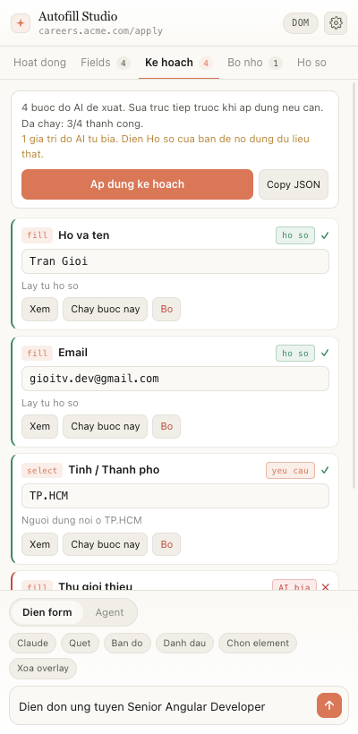
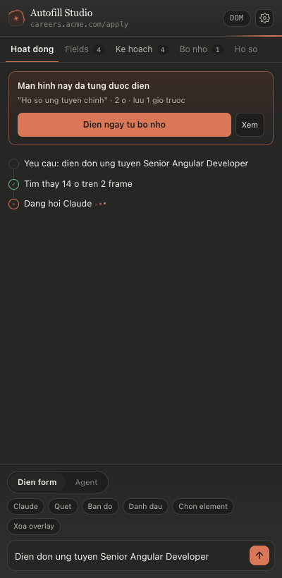

# Autofill Studio

Extension Chrome (MV3) tự điền dữ liệu vào **bất kỳ form nào trên bất kỳ trang web nào**, bằng AI. Bên trong là một **locator engine kiểu Playwright** và một **overlay/inspector kiểu Chrome DevTools**.

Ba chế độ, chọn theo việc:

| | Dùng khi | Chi phí |
|---|---|---|
| **Điền form** | Một form, một màn hình | 1 lần gọi AI |
| **Agent** | Nhiều bước, nhiều trang — bấm, điều hướng, chờ, đọc, rồi điền | 1 lần gọi AI **mỗi lượt** |
| **Bộ nhớ** | Màn hình đã từng điền | 0 — không gọi AI |

<p align="center">
  
  
</p>

---

## Cài trong 2 phút

1. Mở `chrome://extensions` → bật **Developer mode**
2. **Load unpacked** → chọn thư mục này
3. Bấm icon extension → mở **Side panel**
4. Panel hiện thẻ **"Chưa kết nối được AI"** với 3 nút — chọn một:
   - **Không key → Dùng Local Bridge**: máy đã có Claude Code / Gemini CLI / Kiro / Ollama. Chạy `node bridge/server.mjs` là xong.
   - **Offline → Dùng Chrome AI**: Gemini Nano chạy trên máy, Chrome 138+.
   - **API key → Dán API key**: mở Cài đặt, dán key Gemini (miễn phí ở AI Studio) / Claude / OpenAI.
5. Bấm **Kiểm tra lại** → thẻ biến mất là dùng được. Mở `testpage/index.html` để thử.

Không phải bấm Lưu trong Cài đặt — mọi thay đổi tự lưu. Chip provider ở thanh dưới (ví dụ `Bridge · claude`) luôn cho biết AI nào đang trả lời; bấm vào là mở Cài đặt.

Phím tắt: `Alt+Shift+F` chạy autofill · `Alt+Shift+P` bật element picker.

---

## Kết nối AI — 5 đường

| Provider | Cách xác thực | Ghi chú |
|---|---|---|
| **Google Gemini** | API key | OAuth qua Vertex AI vẫn có, giấu trong mục *Nâng cao* vì cần Google Cloud project |
| **Anthropic Claude** | API key | Gửi kèm header `anthropic-dangerous-direct-browser-access` |
| **OpenAI-compatible** | API key | OpenAI, OpenRouter, DeepSeek, Groq, LM Studio, vLLM, gateway nội bộ |
| **Chrome Built-in AI** | Không cần gì | Gemini Nano chạy **offline** trên máy, miễn phí, Chrome 138+ |
| **Local Bridge** | Không cần key | Gọi lại CLI bạn đã đăng nhập sẵn: Claude Code, Gemini CLI, Kiro CLI, Ollama. **Đường dễ nhất nếu máy đã có CLI.** |

### Vì sao không dùng lại cookie của claude.ai / gemini.google.com

Bạn có hỏi về hướng này. Nó vi phạm ToS của cả hai bên, có thể làm khoá tài khoản, và sẽ vỡ mỗi lần họ đổi endpoint nội bộ — nên tôi không viết. Hai đường thay thế đạt đúng mục tiêu "không tốn thêm tiền" mà vẫn hợp lệ:

- **Chrome Built-in AI** — model chạy ngay trên máy, không gửi nội dung trang ra ngoài, không tốn đồng nào.
- **Local Bridge** — extension gọi `http://127.0.0.1:8765`, server Node đó gọi lại `claude` / `gemini` / `q` CLI mà **bạn đã đăng nhập bằng tài khoản của chính bạn**. Cùng một subscription, đúng kênh chính thức.

### Chạy Local Bridge

```bash
node bridge/server.mjs
```

Bridge in ra danh sách AI tìm thấy trên máy và đánh dấu ★ cái sẽ dùng khi extension để "Tự chọn":

```
Autofill Studio Bridge v0.3.0 dang chay tai http://127.0.0.1:8765
  Backend tim thay:
   ★ claude   Claude Code CLI
     gemini   Gemini CLI
     kiro     Kiro CLI (Amazon Q)  (binary: q)
     ollama   Ollama  model: qwen2.5:7b, llama3.1:8b
  ★ Mac dinh: claude  (tu chon: cai dau tien tim thay)
  Doi mac dinh:  node bridge/server.mjs --backend gemini
  Hoac chon truc tiep trong extension: Cai dat -> Local Bridge -> Backend.
```

**Máy có nhiều AI thì chọn cái nào?** Hai chỗ, chỗ nào cũng được:

- Trong extension: **Cài đặt → Local Bridge → Backend** là dropdown lấy thẳng từ bridge — mỗi CLI một dòng, Ollama liệt kê từng model đã pull. Chọn ở đây là ưu tiên cao nhất.
- Khi chạy bridge: `--backend gemini`, `--backend claude:sonnet`, `--backend ollama:qwen2.5:7b`. Áp dụng khi extension để "Tự chọn".

Mỗi lần điền, panel ghi rõ **"Trả lời bởi: Bridge → claude"** và chip ở thanh dưới hiện `Bridge · claude`, nên không bao giờ phải đoán. Log của bridge cũng in từng request: backend nào, mất bao lâu, và vì sao chọn nó (`extension` / `flag` / `auto`).

Mọi tuỳ chọn là **cờ dòng lệnh, giống nhau trên bash / PowerShell / cmd** — không phải nhớ cú pháp env var của từng shell:

```bash
node bridge/server.mjs --list                       # chỉ xem máy có AI nào
node bridge/server.mjs --backend gemini             # đổi mặc định
node bridge/server.mjs --port 8790 --token bimat    # cổng khác + bắt token
node bridge/server.mjs --cmd "my-cli --json"        # lệnh riêng, nhận prompt qua stdin
node bridge/server.mjs --help
```

Biến môi trường `AF_PORT` `AF_TOKEN` `AF_BACKEND` `AF_CMD` `AF_OLLAMA` vẫn dùng được; cờ đè lên biến.

**Token có cần không?** Không, trong đa số trường hợp. Bridge chỉ nhận request từ extension (`chrome-extension://`) hoặc từ dòng lệnh; một trang web bất kỳ mở trong trình duyệt bị từ chối 403, nên không ai mượn được subscription của bạn. `--token` là lớp khoá thêm nếu muốn — dán cùng chuỗi vào *Nâng cao → Token* trong Cài đặt, và ô lệnh trong Cài đặt sẽ tự in ra lệnh đúng để copy.

Cổng 8765 bị chiếm thì bridge nói thẳng và gợi ý `--port 8766`. CLI chưa đăng nhập thì lỗi trả về kèm đúng lệnh đăng nhập (`claude` → `/login`, `gemini` → `/auth`, `kiro login`).

**Về Kiro:** AWS đã đổi tên Amazon Q Developer CLI thành **Kiro CLI**, binary từ `q` sang `kiro`. Bridge dò lần lượt `kiro` → `kiro-cli` → `q` nên bản nào cũng chạy, và `model` nhận cả `kiro` lẫn `q`. Đăng nhập:

```bash
# macOS
brew install --cask kiro-cli

# Windows — tải installer từ trang Kiro, hoặc:
winget install Amazon.Kiro

kiro login          # chọn Free (AWS Builder ID) hoặc Pro (IAM Identity Center)
kiro whoami         # kiểm tra
```

`GET /health` trả về danh sách chi tiết, cái mặc định, và có đang yêu cầu token không:

```json
{
  "ok": true, "version": "0.3.0",
  "backends": ["claude", "kiro", "ollama"],
  "bins": { "claude": "claude", "kiro": "q", "ollama": "http://127.0.0.1:11434" },
  "detail": [
    { "name": "claude", "label": "Claude Code CLI", "bin": "claude", "path": "/usr/local/bin/claude" },
    { "name": "kiro", "label": "Kiro CLI (Amazon Q)", "bin": "q", "path": "/usr/local/bin/q" },
    { "name": "ollama", "label": "Ollama", "models": ["qwen2.5:7b"] }
  ],
  "default": { "name": "claude", "model": "", "why": "auto" },
  "auth": "none"
}
```

`POST /v1/complete` trả về `backend`, `model`, `why` bên cạnh `text` / `json` — extension dùng để hiện "Trả lời bởi".

### OAuth Google (chỉ khi thật sự cần)

Nằm trong *Cài đặt → Gemini → Nâng cao*. Với hầu hết người dùng, API key ở AI Studio là đủ và dễ hơn nhiều. Chỉ đi đường này nếu công ty bắt buộc dùng Vertex AI:

1. Google Cloud Console → APIs & Services → Credentials → **OAuth client ID** → loại *Web application*
2. Redirect URI: lấy chuỗi hiện trong trang Cài đặt (dạng `https://<extension-id>.chromiumapp.org/oauth2`)
3. Bật **Vertex AI API** cho project
4. Điền Client ID + Project ID → **Đăng nhập Google**

---

## Các ca khó đã xử lý

Đây là phần bạn hỏi kỹ nhất, nên liệt kê cụ thể:

**Angular mới nhất (signals, zoneless), MFE, Nx**
`setNativeValue` dùng prototype setter nên Angular không ghi đè ngược; chuỗi event đầy đủ `beforeinput → input → change → blur → focusout` để reactive forms cập nhật cả `value` lẫn `touched`. Nhiều app Angular trên cùng trang (module federation) đều được quét vì scanner đi qua **mọi shadow root và mọi iframe cùng origin**, mỗi frame chạy content script riêng và service worker gộp kết quả lại.

**Dropdown custom** — `mat-select`, `p-dropdown`, `nz-select`, `ng-select`, `MuiAutocomplete`, hoặc bất cứ thứ gì có `role="combobox"`. Engine click mở panel, chờ overlay xuất hiện (`.cdk-overlay-container`, `.ant-select-dropdown`, …), đọc option, khớp mờ có bỏ dấu tiếng Việt ("ha noi" khớp "Hà Nội"), click chọn, rồi Escape đóng lại. Nếu panel có ô tìm kiếm thì gõ để lọc trước — xử lý được virtual scroll.

**Multi-select** — chọn lần lượt, tự mở lại panel nếu nó đóng sau mỗi lần click, đóng hẳn khi xong.

**Upload file** — dựng `File` thật bằng `DataTransfer` rồi gán vào `input.files`. Không có input thì bắn `dragenter/dragover/drop` vào dropzone (react-dropzone, ngx-dropzone). Chế độ CDP còn dùng được `DOM.setFileInputFiles` để nạp **file thật từ ổ đĩa**.

**Rich text** — Quill, ProseMirror, Draft, CKEditor inline: dùng `execCommand('insertText')` để editor nhận đúng `beforeinput`.

**Khác** — checkbox/toggle custom, radio group, date input (tự đổi `12/03/1995` → `1995-03-12` theo chuẩn Việt Nam), input có mask (gõ từng ký tự).

---

## Dữ liệu điền vào lấy từ đâu

Câu hỏi đáng hỏi nhất, nên nó được trả lời ngay trên giao diện: **mỗi giá trị đều mang một nhãn nguồn**.

| Nhãn | Nghĩa |
|---|---|
| `hồ sơ` | Copy nguyên văn từ **Hồ sơ** bạn tự điền |
| `yêu cầu` | Bạn viết ra trong ô prompt |
| `từ trang` | Suy ra từ nội dung trang đang mở |
| `AI bịa` | Không có ở đâu cả — model tự nghĩ ra |

Thứ tự ưu tiên là tuyệt đối: **hồ sơ > yêu cầu > trang > tự nghĩ**. Có trong hồ sơ thì bắt buộc dùng nguyên văn, không "làm đẹp", không đổi định dạng.

Tab **Hồ sơ** trong side panel là nơi bạn dán dữ liệu thật của mình:

```
Họ tên: Trần Giới
Email: gioitv.dev@gmail.com
Điện thoại: 09xxxxxxxx
Địa chỉ: 123 Nguyễn Huệ, Quận 1, TP.HCM
Chức danh: Senior Frontend Developer
Kinh nghiệm: 6 năm Angular, RxJS, Nx
```

Để trống thì mọi giá trị đều là `AI bịa` — và tab Kế hoạch sẽ cảnh báo *"N giá trị do AI tự bịa"* ngay trên đầu, để bạn không lỡ gửi đi một hồ sơ toàn thông tin ảo. Model **không được phép bịa** số CMND/CCCD, mã số thuế, số tài khoản; không có trong hồ sơ thì nó bỏ qua field đó.

Nếu model quên khai nguồn, extension mặc định gán `invented` — nghi ngờ trước đã, an toàn hơn.

Hồ sơ nằm trong `chrome.storage.local` trên máy bạn, không đồng bộ đi đâu, chỉ gửi kèm khi bạn thực sự chạy một lần điền.

---

## Chế độ Agent

Giống cách Playwright MCP hay Claude điều khiển trình duyệt: model **không thấy DOM**, nó thấy một bản đồ phẳng của trang, mỗi dòng một element kèm ref.

```
e1   textbox   "Họ và tên" *
e2   textbox   "Email" * = "a@example.com"
e3   combobox  "Tỉnh / Thành phố" = "Đà Nẵng"
e4   checkbox  "Tôi đồng ý với điều khoản" *
e5   button    "Tiếp tục"
e6   link      "Điều khoản" -> /terms
```

Mỗi lượt model trả về một nhóm hành động, extension chạy, **chụp lại trang**, đưa bản đồ mới. Lặp đến khi xong.

**Công cụ:** `fill` `type` `select` `check` `radio` `upload` `click` `press` `scroll` `navigate` `back` `wait` `read`

**Bốn thứ giữ cho nó không chạy loạn:**

1. **Ref đánh số lại sau mỗi lần chụp.** Model không giữ được tham chiếu cũ qua lượt — không thể click nhầm thứ đã biến mất. Ref không có thật thì báo lỗi vào lịch sử chứ không crash.
2. **Hành động làm trang đổi thì cắt lượt ngay.** `click`/`navigate`/`back`/`press` thành công là dừng, chụp lại. Mọi hành động xếp sau trong cùng lượt bị bỏ — vì chúng được nghĩ ra dựa trên trang cũ.
3. **Trần số lượt** (mặc định 12, đổi trong Cài đặt) và **nút dừng** ăn ngay sau hành động đang chạy.
4. **Không tự bấm nút gây hậu quả** — thanh toán, đặt hàng, chuyển tiền, xoá vĩnh viễn, gửi đơn — trừ khi mục tiêu bạn viết ra nói rõ. Gặp captcha thì báo `blocked` chứ không tìm cách vượt.

Nút **Bản đồ** ở thanh dưới in ra đúng cái model sẽ đọc — tiện khi nó làm sai và bạn muốn biết vì sao.

---

## Bộ nhớ theo màn hình

Điền form bằng AI tốn một lần gọi model. Lần thứ hai vào đúng màn hình đó thì không cần nữa.

Sau mỗi lần autofill thành công, extension **chụp lại giá trị đang có trên form** và lưu vào `chrome.storage.local`. Lần sau mở lại trang, side panel hiện banner *"Màn hình này đã từng được điền"* → bấm **Điền ngay từ bộ nhớ** là xong, không có request nào đi ra ngoài.

**Nhận diện màn hình.** Khoá lưu là `host + path` đã chuẩn hoá: id số, UUID, hash dài bị thay bằng `:id`, query và hash bị bỏ. Nên `/apply/999?ref=fb` và `/apply/12345` là **cùng một màn hình**, còn `/checkout` thì không.

**Khớp lại field.** `afId` sinh mới mỗi lần load trang nên không dùng làm khoá được. Mỗi ô được lưu kèm một chữ ký bền (`name`/`formcontrolname`, `data-testid`, nhãn, section, selector, loại), lần sau chấm điểm để ghép:

| Trùng | Điểm |
|---|---|
| `name` / `formcontrolname` | +100 |
| `data-testid` | +90 |
| selector | +60 |
| nhãn | +45 |
| placeholder · section · loại | +25 · +15 · +15 |
| khác nhóm (text ↔ checkbox…) | −40 |

Ngưỡng ghép là 55. Nghĩa là bạn **đổi nhãn, đổi class, đảo thứ tự field** thì vẫn khớp; còn form thay hẳn thì nó ghép 0 ô chứ không điền bừa.

**Không bao giờ được lưu:** `type="password"`, và mọi ô có nhãn/tên dính OTP, CVV/CVC, số thẻ, secret, token, API key, PIN, captcha. Ô rỗng và checkbox chưa tick cũng bỏ qua cho gọn.

Tab **Bộ nhớ** trong side panel: lưu thủ công nhiều bản cho cùng một màn hình (ví dụ "Hồ sơ A" / "Hồ sơ B"), xem trước phần ghép được trước khi điền, đổi tên, xoá. Tắt tự lưu / tự gợi ý trong **Cài đặt**.

**Mang sang máy khác.** `Xuất file` tải về một JSON, `Copy JSON` cho vào clipboard, `Nhập` dán ngược lại. Nhập là **gộp** chứ không đè: trùng `id` thì giữ bản `usedAt` mới hơn, nên nhập đi nhập lại cùng một file không nhân bản dữ liệu. Bản lưu hỏng trong file bị bỏ qua và báo số lượng, không làm hỏng kho đang có.

---

## Hai cách gửi event: DOM và CDP

**DOM** (mặc định) — nhanh, không hiện thanh cảnh báo. Đủ cho hầu hết trang.

**CDP** — bấm nút `DOM`/`CDP` ở góc side panel để đổi. Dùng `chrome.debugger` gửi event **trusted** (`isTrusted === true`), giống hệt người thật gõ phím. Cần khi trang kiểm tra `isTrusted` hoặc khi cần upload file thật từ đĩa. Đánh đổi: Chrome hiện thanh vàng "đang gỡ lỗi trình duyệt".

---

## DevTools panel

Mở DevTools → tab **Autofill Studio**. Đây là phần "giống Playwright Inspector":

- Bảng toàn bộ field đã quét, click một dòng để nhảy tới và nháy sáng element
- **Locator playground** — gõ `role=textbox|name=Email`, `label=Họ và tên`, `testid=submit`, `css=#email`, `//input[@id="email"]`, hoặc JSON. Trả về số kết quả khớp + trạng thái visible/enabled từng cái, y như `page.locator(...)`
- Chạy thử một action đơn lẻ để debug trước khi cho AI chạy cả plan
- **Element picker** — hover highlight + tooltip như DevTools Inspect, click để lấy locator gợi ý (ưu tiên `data-testid` → `role+name` → `label` → CSS)

---

## Luồng hoạt động

```
Chế độ Điền form — side panel: nhập yêu cầu
      ↓
Service worker: liệt kê mọi frame → inject content script → quét field
      ↓  (deep scan: mở từng dropdown custom để đọc option thật)
Provider AI: system prompt + FIELDS + ngữ cảnh trang → JSON schema ép output
      ↓
Plan hiện ra: sửa được từng giá trị trước khi chạy
      ↓
Action engine: DOM hoặc CDP, auto-wait + actionability check từng bước
      ↓
Kết quả: xanh/đỏ từng field, log chi tiết
```

Chế độ Agent thì lặp:

```
mục tiêu
   ↓
┌─→ chụp bản đồ trang (mọi frame) → đánh số ref e1..eN
│      ↓
│  model chọn nhóm hành động
│      ↓
│  chạy — dừng ngay sau hành động làm trang đổi
│      ↓
└── chưa xong? lặp lại (tối đa N lượt)
       ↓
    done / blocked / hết lượt
```

Có bộ nhớ rồi thì đường đi ngắn hơn hẳn:

```
Side panel: bấm "Điền ngay từ bộ nhớ"
      ↓
Quét field → ghép chữ ký với bản lưu → điền.  Không có bước gọi AI.
```

Plan **không tự chạy mù** — bạn xem, sửa giá trị, bỏ bước không muốn, chạy lại từng bước riêng lẻ. Copy JSON plan ra để tái sử dụng.

---

## Chi phí

Mỗi lần gọi model đều được cộng vào một chip ở thanh soạn: `phiên này: 6.3k tok · 2 lần gọi`. Rê chuột lên xem tách vào/ra.

Đáng để ý ở chế độ Agent — **mỗi lượt là một lần gọi model**, nên chạy 12 lượt là 12 lần. Mỗi thẻ lượt hiện token cộng dồn của phiên agent, và dòng kết thúc tổng kết lại. Form một trang thì dùng "Điền form" cho rẻ; agent để dành cho việc nhiều bước.

Mỗi provider báo token một kiểu khác nhau (`prompt_tokens` / `input_tokens` / `promptTokenCount`), `src/lib/usage.js` quy về một dạng. Anthropic có prompt caching thì token đọc từ cache cũng được tính vào phần vào. Chrome Built-in AI không báo gì nên chip sẽ không hiện.

---

## Giao diện

Icon là hình đầu một agent đeo mặt nạ, tự vẽ bằng SVG (`icons/icon.svg`) — bản 16/32px dùng biến thể rút gọn `icon-small.svg` vì ở cỡ đó tia sáng và cổ chỉ thành vệt mờ.

Bảng màu mượn của Claude — nền giấy ấm `#faf9f5`, chữ than, điểm nhấn đất sét `#d97757`, wordmark serif. Tối là biến thể `#262624`, tự đổi theo hệ điều hành.

Trong lúc chạy, panel nói cho bạn biết nó đang làm gì chứ không đứng im: tia sáng ở góc quay chậm, một vạch tiến trình mảnh chạy dưới thanh tiêu đề, bước đang chạy có vòng tròn lan toả và ba chấm nhấp nháy, tool call hiện ra lần lượt chứ không bụp một phát, và tab Fields hiện khung xương quét sáng trong lúc chờ. Tất cả tự tắt khi bạn bật `prefers-reduced-motion`.

<p align="center">
  
  
</p>

---

## Chạy trên Windows

Extension thì không có gì khác — Chrome là Chrome. Chỗ khác nhau nằm ở **Local Bridge**, vì nó spawn tiến trình:

- **Dò CLI** dùng `where` thay `which`, và lấy đường dẫn đầy đủ để biết thứ tìm được là `.exe` hay `.cmd`.
- **Shim `.cmd`** — CLI cài bằng npm trên Windows là file `.cmd`, Node chỉ chạy được qua `cmd.exe`. Bridge tự phát hiện và bọc đối số đúng cách, thay vì bật `shell: true` cho mọi thứ (bật bừa thì nội dung trang web sẽ bị `cmd.exe` diễn giải — vừa vỡ vừa nguy hiểm).
- **Prompt đi qua stdin**, không qua dòng lệnh. System prompt dài, nhiều dòng, có dấu nháy — đưa vào argv là hỏng trên Windows. Riêng `gemini` bắt buộc dùng `-p <prompt>` nên vẫn qua argv; nếu gặp lỗi lạ với Gemini CLI trên Windows thì đổi sang backend `claude` hoặc `ollama`.
- **`--cmd` / `AF_CMD`** tách theo dấu nháy, nên đường dẫn có dấu cách vẫn chạy:
  `node bridge/server.mjs --cmd "\"C:\Program Files\ai\cli.exe\" --json"`
- **Cờ dòng lệnh** (`--port`, `--token`, `--backend`) giống hệt trên PowerShell và cmd, không phải nhớ `$env:` hay `set`.
- **`.gitattributes`** ép LF, để shebang của `server.mjs` không chết vì CRLF.

Phím tắt `Alt+Shift+F` / `Alt+Shift+P` giống nhau hai bên. Trong side panel, `Cmd+Enter` và `Ctrl+Enter` đều chạy.

Thành thật: tôi kiểm thử trên macOS. Phần Windows là sửa theo đúng tài liệu Node về spawn và shim `.cmd`, chưa chạy thật trên máy Windows.

---

## Giới hạn có thật

- **Closed shadow DOM** không đọc được — đây là giới hạn của trình duyệt, không có cách vòng.
- **Iframe khác origin** cần content script chạy trong đó; `all_frames: true` phủ được nếu extension có quyền trên domain đó.
- **Captcha, OTP, mật khẩu, thẻ tín dụng** bị chặn ở tầng prompt — cố tình không hỗ trợ.
- **Chrome Built-in AI** không nhận JSON schema, chất lượng thấp hơn model cloud với form phức tạp.
- Nội dung trang (label field + trích đoạn text) được gửi tới provider bạn chọn. Dùng Chrome Built-in AI hoặc Ollama qua Bridge nếu dữ liệu nhạy cảm.

---

## Cấu trúc

```
manifest.json
icons/              icon.svg + icon-small.svg (16/32) → PNG 16·32·48·128
src/
  background/  service-worker.js  điều phối, đa frame
               cdp.js             driver chrome.debugger
  content/     00-util.js         shadow DOM walk, waitFor, hit-test
               10-locator.js      locator engine + accessible name
               20-scanner.js      nhận diện field
               30-actions.js      fill/select/check/upload/click
               40-picker.js       overlay + element picker
               50-snapshot.js     bản đồ trang cho agent (ref + role + value)
               99-main.js         message bridge
  providers/   gemini · anthropic · openai · chromeai · bridge
  lib/         agent.js    vòng lặp agent: tool, prompt, ref map
               usage.js    quy token của 5 provider về một dạng
               prompt.js   system prompt + schema
               storage.js  cài đặt
               screen.js   nhận diện màn hình + chấm điểm khớp field
               memory.js   kho bản lưu theo màn hình
  sidepanel/   panel.html/js/css   5 tab: Hoạt động · Fields · Kế hoạch · Bộ nhớ · Hồ sơ
  devtools/    panel.html/js
  options/     options.html/js
bridge/server.mjs   Local Bridge (Node, không dependency)
testpage/           form thử: Material select, multi-select, shadow DOM, iframe, dropzone
```

## Trạng thái kiểm thử

**Action engine** — chạy qua Playwright trên `testpage/index.html`: **12/12 field điền đúng** — text, email, date (đổi đúng định dạng VN), textarea, mat-select đơn, mat-select multi (3 giá trị), native select, radio group, checkbox, file upload, và 2 field nằm trong shadow DOM.

**Bộ nhớ theo màn hình** — test lưu/ghép với `chrome.storage` giả lập: lọc đúng 4/8 ô (bỏ password, OTP, ô rỗng, checkbox chưa tick), gom `/apply/999` với `/apply/12345` về một khoá, ghép lại đủ 4 ô sau khi selector đổi và thứ tự đảo, checkbox trả về boolean, và ghép **0 ô** khi thả vào một form không liên quan.

**Bridge** — `/health` và `/v1/complete` chạy thật, xác nhận `kiro` và `q` cùng trỏ về một backend và báo lỗi rõ khi chưa cài CLI. Bản 0.3: token sai trả 401 kèm hướng dẫn, origin `https://` lạ bị chặn 403, preflight từ `chrome-extension://` được phép, `--backend custom` được đánh dấu mặc định trong `/health`, backend không tồn tại báo danh sách hợp lệ. Extension nạp thật vào Chromium: thẻ "Chưa kết nối" hiện đúng 3 nút khi thiếu key, in đúng lệnh khi bridge tắt, chip đổi thành `Bridge · custom` khi bridge chạy, và một lần điền qua bridge ghi "Trả lời bởi: Bridge → custom". `AF_CMD` với đường dẫn có dấu cách và đối số trong dấu nháy tách đúng. Backend `claude` gửi system prompt qua stdin — argv chỉ còn `-p --output-format text`, không còn nội dung trang nào lọt vào dòng lệnh.

**Agent** — chạy `service-worker.js` thật trong Node với `chrome.*` giả lập và một "model" HTTP trả JSON theo kịch bản, trên một trang 2 bước: đi hết 2 bước và kết thúc `done`; dừng đúng sau `click` nên hành động xếp sau bị bỏ; ref không tồn tại báo lỗi chứ không crash; lượt 2 nhận bản đồ mới + lịch sử lượt 1; không tự bấm "Gửi hồ sơ". Nút dừng trả `stopped` giữa chừng, trần lượt trả `maxsteps`.

**Xuất/nhập bộ nhớ** — 10 assert: round-trip giữ đủ dữ liệu, nhập lại cùng file không nhân bản, bản mới hơn ghi đè bản cũ, bản lưu hỏng bị bỏ qua mà vẫn nhận bản tốt, JSON hỏng và thiếu mảng `snapshots` đều báo lỗi rõ ràng, chế độ thay thế xoá sạch trước khi nhập.

**Đếm token** — 7 assert cho `usage.js` (OpenAI / Anthropic / Anthropic có cache / Gemini / không có usage / cộng dồn / định dạng), cộng 3 assert chạy qua vòng lặp agent thật: tổng cộng dồn đúng, đếm đúng số lần gọi, và mỗi lượt báo token của riêng nó.

**Nguồn dữ liệu** — `source` từ model được giữ nguyên; model quên khai thì mặc định `invented`; schema bắt buộc có `source` và chỉ nhận 4 giá trị hợp lệ.

**Bản đồ trang** — `50-snapshot.js` chạy trên `testpage/index.html` thật: đọc đúng 18 element gồm cả shadow DOM, và sau khi hành động thì phản ánh đúng giá trị của mat-select, multi-select, native select, radio, checkbox — không nhầm placeholder (`-- Chọn --`, `Chọn...`) thành giá trị.
